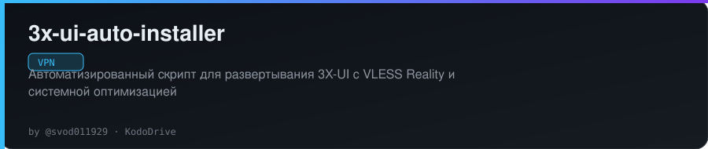
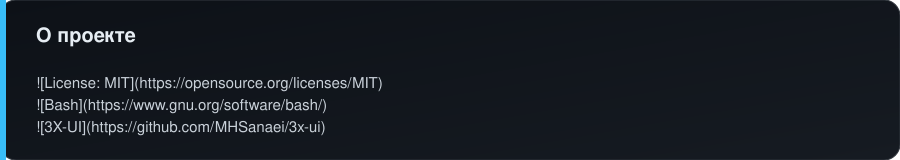
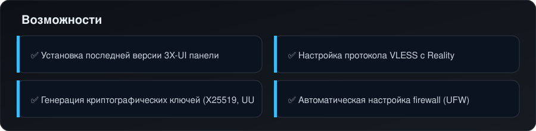
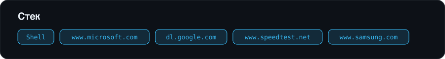

<!-- kododrive-readme-style -->

  

 

  
  &nbsp;
  
  &nbsp;
  

---

  

 

  

---

# 3X-UI Auto-Installer с VLESS Reality

Автоматизированный скрипт для развертывания и оптимизации VPN-сервера на базе 3X-UI с протоколом VLESS Reality. Включает системные оптимизации для максимальной производительности на серверах в Финляндии, Германии и других европейских локациях.

---

  

 

  

<!-- /kododrive-readme-style -->

---

<!-- kododrive-projects-block -->

## Проекты KodoDrive

Другие проекты: [профиль @svod011929](https://github.com/svod011929) · [Telegram](https://t.me/KodoDrive)

### VPN и инфраструктура

- [BuryatVPN](https://github.com/svod011929/buryatvpn)
- [VPN Server Installer](https://github.com/svod011929/vpn-server-installer)
- **3X-UI Auto Installer** ← ты здесь
- [AWG Bot Installer](https://github.com/svod011929/awg-bot-installer)
- [RemnaShop Installer](https://github.com/svod011929/remnashop-installer)
- [VPN Auto Installer](https://github.com/svod011929/vpn-auto-installer)
- [VPNHubBot](https://github.com/svod011929/VPNHubBot)

### Telegram и автоматизация

- [KDS Server Panel](https://github.com/svod011929/KDS_Server_Panel)
- [Telegram → VK Poster](https://github.com/svod011929/telegram-to-vk-poster)
- [KDS Parser CryptoBot](https://github.com/svod011929/kds_parser_cryptobot)
- [Auction Bot](https://github.com/svod011929/auction-bot)
- [Invest Bot](https://github.com/svod011929/invest-bot)
- [Crypto Check Bot](https://github.com/svod011929/crypto-check-bot)
- [KodoRefStarsBot](https://github.com/svod011929/KodoRefStarsBot)

### Магазины и финансы

- [KodoCashFlow](https://github.com/svod011929/KodoCashFlow)
- [Telegram Crypto Shop](https://github.com/svod011929/telegram-crypto-shop)
- [TalkProfit](https://github.com/svod011929/talkprofit)

### Сайты

- [Portfolio](https://github.com/svod011929/kododrive-portfolio)
- [GitHub Pages](https://github.com/svod011929/kododrive.github.io)

<!-- /kododrive-projects-block -->

